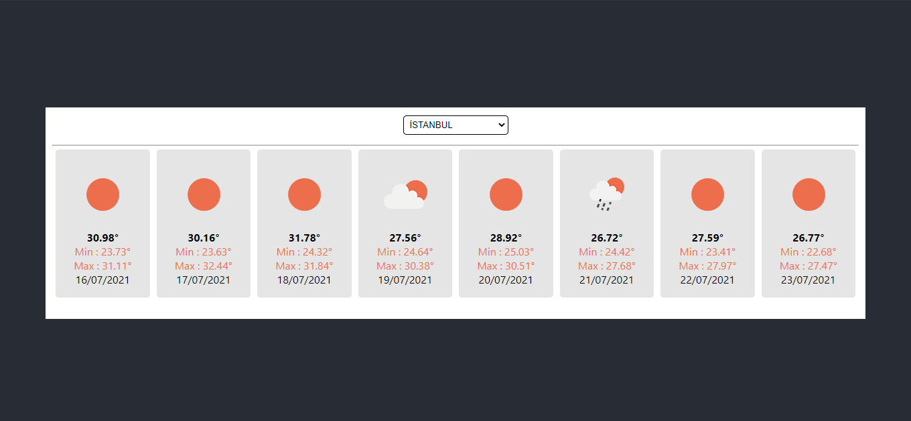

## NETLIFY DEMO
[NETLIFY DEMO - CLICK ](https://weather-forecast-oguzcanuzunoner.netlify.app/)

# The Weather Forecast Uygulaması

Uygulamamızda, API'den çekilen hava durumu bilgilerini listeliyoruz. 

## Proje Hakkında

Bu projede, Ana sayfada şehrinizi seçerek, 7 günlük hava durumunu öğrenebilirsiniz.

## Proje Teknik Bilgileri

* 
* Bilgiler API'den çekilmiştir. Bunun için OpenWeatherMap kullanılmıştır.
* API'den veri çekmek için AXIOS kullanılmıştır.
* Enlem ve boylam bilgileri JSON dosyasından alınmıştır. Kaynak : [abdullahoguk](https://gist.github.com/abdullahoguk/ee03c26a23dca6eda9c480b4967e77b6#file-il-json)

## Proje Nasıl Çalıştırılır

- Projeyi fork'ladıktan ya da indirdikten sonra projenin bulunduğu klasörde "npm install" komutu ile gerekli paketlerin yüklenmesi gerekiyor.
- Daha sonra "npm run start" komutu ile uygulama başlatılabilir.

 

## Ekran Görüntüsü

### Home Page

  

## Licence
---
[MIT](https://choosealicense.com/licenses/mit/)
